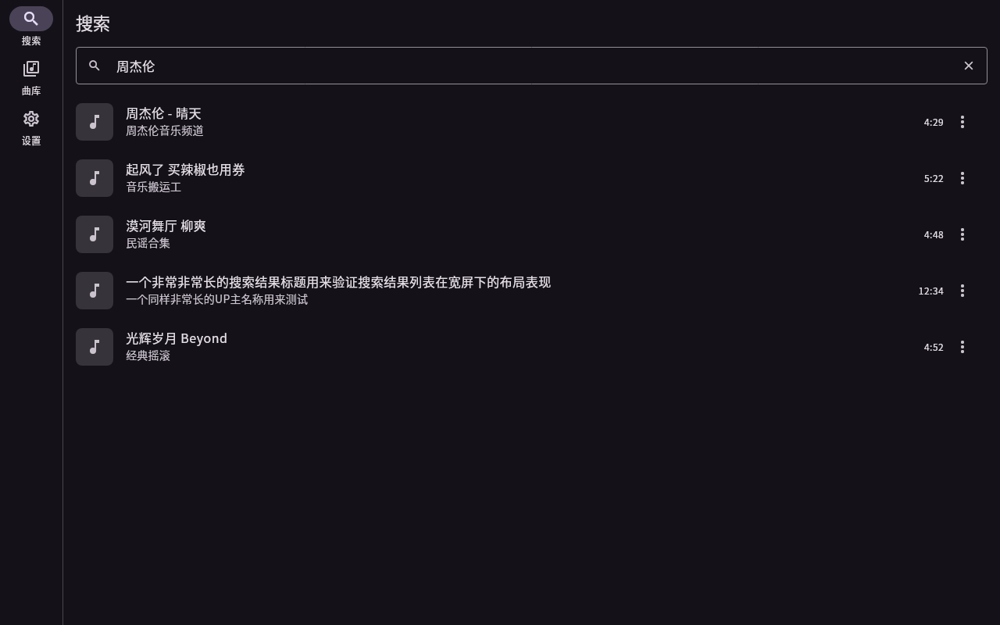

<div align="center">


# Flind Player

**跨平台音乐播放器 · 让 Bilibili 走进你的曲库**

在线音源（Bilibili）与本地曲库在统一界面中无缝混合 —— 搜索即播、离线可听、全平台系统集成。

<br />


</div>

<br />

## ✨ 功能特性

<table align="center">
  <tr>
    <td width="50%" valign="top">
      <h4>🎧 Bilibili 在线音源</h4>
      <p>WBI 签名 API 直连，防盗链 CDN 播放（自动注入 Referer / UA）；直播流过期（403）自动刷新并跳回原进度，边听边播不中断。被收录曲目可一键离线缓存。</p>
    </td>
    <td width="50%" valign="top">
      <h4>📚 统一曲库</h4>
      <p>在线与本地在同一个曲库中混合呈现，可搜索、排序、收藏。本地扫描基于 <code>audio_metadata_reader</code> 纯 Dart 解析，3392 首曲目不到 200ms。</p>
    </td>
  </tr>
  <tr>
    <td width="50%" valign="top">
      <h4>💾 离线缓存</h4>
      <p>Bilibili 音频缓存到本地，默认 <strong>1 GiB</strong> 可配置，LRU 自动淘汰；手动下载的曲目 <strong>pinned 固定</strong>，断网也能播放。</p>
    </td>
    <td width="50%" valign="top">
      <h4>🔌 深度系统集成</h4>
      <p>Android 通知栏 / 锁屏媒体控制、Linux MPRIS²、Windows SMTC、macOS/iOS Now Playing 统一由 <code>audio_service</code> 承载；桌面端托盘 + 关闭到托盘。</p>
    </td>
  </tr>
  <tr>
    <td width="50%" valign="top">
      <h4>🔁 队列与收藏</h4>
      <p>播放队列（含洗牌前顺序）自动持久化，重启后恢复（默认暂停，不打扰）；本地收藏 + 自建歌单（创建 / 改名 / 封面 / 简介 / 增删歌曲）+ 浏览 Bilibili 公开收藏夹。曲库页分成 全部 / 收藏 / 歌单 三段。</p>
    </td>
    <td width="50%" valign="top">
      <h4>🖥️ 自适应 Material 3</h4>
      <p>窄屏底部导航、宽屏侧边导航自动切换；亮 / 暗 / 跟随系统主题；迷你播放条、播放模式（单曲 / 列表 / 随机）、睡眠定时。</p>
    </td>
  </tr>
</table>

<p align="center"><small><em>⚠️ 本项目仅供个人学习使用：不内置任何账号凭证，也不提供带凭证的公共代理。</em></small></p>

<br />

## 📸 界面预览

<table align="center">
  <tr>
    <td width="50%"><p align="center"></p></td>
    <td width="50%"><p align="center"></p></td>
  </tr>
  <tr>
    <td width="50%"><p align="center"><em>正在播放 · 暗色</em></p></td>
    <td width="50%"><p align="center"><em>曲库 · 移动端亮色</em></p></td>
  </tr>
  <tr>
    <td width="50%"><p align="center"></p></td>
    <td width="50%"><p align="center"></p></td>
  </tr>
  <tr>
    <td width="50%"><p align="center"><em>曲库 · 桌面网格亮色</em></p></td>
    <td width="50%"><p align="center"><em>Bilibili 搜索 · 暗色</em></p></td>
  </tr>
</table>

<br />

## 🧰 技术栈

| 层 | 技术 | 说明 |
| --- | --- | --- |
| UI | Flutter · Material 3 | 自适应断点（< 600px 紧凑模式 / 宽屏模式） |
| 状态管理 | `flutter_riverpod` 3 | Notifier + 依赖注入 |
| 播放引擎 | `just_audio` + `audio_service` | 桌面端经 `just_audio_media_kit`（libmpv） |
| 数据库 | `drift`（SQLite + FTS5） | 曲库 / 收藏 / 队列持久化 |
| 网络 | `dio` | WBI 签名请求 + CDN 防盗链头 |
| 桌面 | `tray_manager` · `window_manager` | 系统托盘、关闭到托盘 |
| 国际化 | flutter gen-l10n | 简体中文 / English |

<br />

## 🖥️ 支持平台

| 平台 | 优先级 | 说明 |
| -------- | -------- | ----- |
| Android | 主推 | 分架构 APK + AAB |
| Linux | 主推 | 需要系统 `libmpv` |
| Windows | 次要 | 内置 mpv，开箱即用 |
| macOS | 次要 | **未签名**预览（Apple Silicon / arm64，保留沙盒，仅加网络权限） |
| iOS | 次要 | **未签名**预览，需自行签名安装；暂不支持本地曲库 |
| Web | 延后 (v2) | CORS 全阻断，需代理（见架构文档 D11） |

<br />

## 🚀 快速开始

```bash
flutter pub get
flutter run -d linux        # Linux 桌面需要系统 libmpv（见下方构建说明）
```

> App 标识：Dart 包 `flind_player` · Android `top.qwind.app.flind_player`
> · iOS/macOS `top.qwind.app.flindPlayer` · Linux `top.qwind.app.flind_player`

<br />

## 🔨 构建与发布

### 本地构建

<details>
<summary><b>🐧 Linux 桌面</b>（libgtk-3 + libmpv + libayatana-appindicator3 + libsecret）</summary>

```bash
sudo apt-get install -y libgtk-3-dev libmpv-dev libayatana-appindicator3-dev libsecret-1-dev
flutter build linux --release
# 产物：build/linux/x64/release/bundle/
```

</details>

<details>
<summary><b>🪟 Windows 桌面</b>（内置 mpv，无需系统库）</summary>

```bash
flutter build windows --release
# 产物：build/windows/x64/runner/Release/（运行 flind_player.exe）
```

> **mpv 预编译包**：首次构建时 `media_kit_libs_windows_audio` 会从
> `https://github.com/media-kit/libmpv-win32-audio-build/releases/download/2023-09-24/`
> 下载 `mpv-dev-x86_64-20230924-git-652a1dd.7z`（约 5 MB）并校验 MD5
> （`cd738e16e2a19626d7cfa48801524f8c`）。国内网络可能下载失败（表现为构建时报
> "Integrity check failed"），此时用任意方式手动下载该归档放入
> `build/windows/x64/` 后重新构建即可（CMake 校验通过后不会再下载）。CI 中用
> `actions/cache` 缓存该归档，升级 `media_kit_libs_windows_audio` 时请同步更新
> 工作流中的归档文件名与缓存 key。

</details>

<details>
<summary><b>🤖 Android</b>（按架构拆分，体积远小于通用包）</summary>

```bash
flutter build apk --release --split-per-abi
# 产物：app-arm64-v8a-release.apk（现代手机）、app-armeabi-v7a-release.apk（32 位老设备）
```

x86_64 仅用于模拟器，不发布。

</details>

<details>
<summary><b>🍎 macOS</b>（Apple Silicon / arm64，未签名，需在 macOS 上构建）</summary>

```bash
flutter build macos --release
# 产物：build/macos/Build/Products/Release/Flind Player.app
```

</details>

<details>
<summary><b>📱 iOS</b>（未签名，需在 macOS 上构建）</summary>

```bash
flutter build ios --release --no-codesign
# 产物：build/ios/iphoneos/Runner.app（CI 会打成未签名 .ipa 供自签安装）
```

</details>

> **Apple 平台为未签名预览版**：长期不做签名 / 公证，也不上架 App Store。macOS 解压后需先
> `xattr -dr com.apple.quarantine "Flind Player.app"` 再打开；iOS 的 `.ipa` 未签名，需用
> AltStore / Sideloadly 等工具以你自己的证书签名后安装；iOS 暂不支持本地曲库。

> **0.2.x 预览版签名**：0.2.x 阶段继续使用 debug 签名，因此**各版本之间不支持覆盖
> 安装**，升级需先卸载旧版本（本地数据会清除）。正式签名计划在 1.0 引入。

> **图标**：全平台图标由 `docs/FlindPlayer.png` 经 `tool/generate_icons.sh` 生成
> （Android 自适应、iOS 无 alpha、Windows 多档 `.ico` 等）。该美术稿是当前占位设计；
> 替换后重跑脚本即可。

### 签名发布（Android）

1. 生成 keystore（只需一次）：

   ```bash
   keytool -genkeypair -v -keystore android/app/keystore.jks \
     -keyalg RSA -keysize 2048 -validity 10000 -alias flind
   ```

2. 在 `android/key.properties` 写入（该文件已被 gitignore）：

   ```properties
   storeFile=keystore.jks
   storePassword=****
   keyAlias=flind
   keyPassword=****
   ```

   `android/app/build.gradle.kts` 检测到该文件时使用其中的签名配置；否则回退到
   debug 签名，因此没有密钥也能执行 `flutter build apk --release`。

### 触发发布工作流

打 tag 并推送即可，GitHub Actions 会构建 Linux、Windows 与 Android 产物并创建 Release：

```bash
git tag v0.2.1
git push origin v0.2.1
```

- `.github/workflows/ci.yml`：push 到 `master` 及 PR 时运行分析、测试与 Linux 构建。
- `.github/workflows/release.yml`：tag 推送时运行，需要以下仓库 secrets 才能产出签名 APK：

| Secret | 说明 |
| ------ | ---- |
| `ANDROID_KEYSTORE_BASE64` | keystore 的 base64：`base64 -w0 android/app/keystore.jks` |
| `ANDROID_KEYSTORE_PASSWORD` | keystore 口令 |
| `ANDROID_KEY_ALIAS` | key alias |
| `ANDROID_KEY_PASSWORD` | key 口令 |

缺少 `ANDROID_KEYSTORE_BASE64` 时，发布仍会进行，但 APK 使用 debug 签名。发布说明中
包含 GPL-3.0 §6 要求的对应源码指向（本仓库的对应 tag）。

<br />

## 📚 文档

| 文档 | 内容 |
| --- | --- |
| [`docs/architecture.md`](docs/architecture.md) | 架构分层、关键决策（ADR）、里程碑与风险 |
| [`docs/bilibili-source.md`](docs/bilibili-source.md) | Bilibili 适配器：端点、WBI 签名、鉴权、限流、法务 |
| [`docs/local-library.md`](docs/local-library.md) | 本地曲库：扫描、元数据、drift schema、离线缓存 |
| [`docs/widget-tree.md`](docs/widget-tree.md) | 轻量级 Widget 树总览 |
| [`docs/缓存延期问题.md`](docs/缓存延期问题.md) | 缓存评审遗留的延期小问题（触发条件 / 后果） |

<br />

## 📈 项目状态

<table align="center">
  <tr>
    <td width="50%" valign="top">
      <h4>✅ 已完成 · M0–M6</h4>
      <ul>
        <li>本地曲库（扫描 + 元数据 + FTS5 检索）</li>
        <li>Bilibili 在线音源（WBI 直连播放）</li>
        <li>离线缓存（1 GiB 默认 · LRU · pinned）</li>
        <li>系统集成（通知栏 / MPRIS / SMTC / 托盘）</li>
        <li>队列持久化与收藏</li>
        <li>歌单（内置收藏 + 自建歌单 · 三段式曲库页）</li>
        <li>CI 与发布流水线实测跑通</li>
      </ul>
    </td>
    <td width="50%" valign="top">
      <h4>⏳ 延后</h4>
      <ul>
        <li>歌词（未排期）</li>
        <li>QR 登录与个人收藏夹（v1.1）</li>
        <li>Web 端（v2）</li>
        <li>Apple 平台签名 / 公证 / TestFlight（长期推迟）</li>
      </ul>
    </td>
  </tr>
</table>

<h4 id="🧪-验证基线">🧪 验证基线</h4>

`flutter analyze` 零问题 · **581** 个单元 / 组件测试通过 · **6** 个集成测试通过 ·
Linux / Android release 构建通过 · CI 与 release 工作流均实测跑通。

<br />

## 📄 License

[**GNU General Public License v3.0**](LICENSE) — 强 copyleft，分发时必须同时提供完整对应源码（GPL-3.0 §6）。个人使用不受此约束。